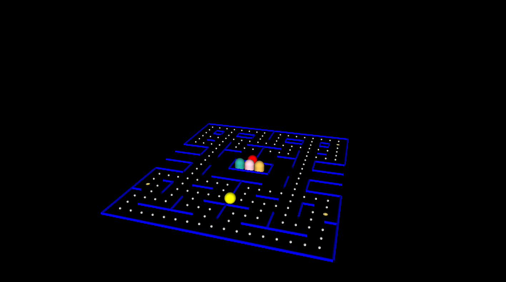

# 4122_Pacman

OS: Ubuntu 18.04.5 LTS\
Environment: Visual Studio IDE

to compile in terminal:g++ -pthread main.cpp ECE_Ghost.cpp ECE_Pacman.cpp map.cpp -lGL -lglut -lGLU -std=c++1z\
to run: ./a.out

Possibly useful interrupts:\
press q/ESC to quit.\
press x to enable ghosts to be paused.\
press g to pause ghosts.\
press p to play again after a win/loss.
